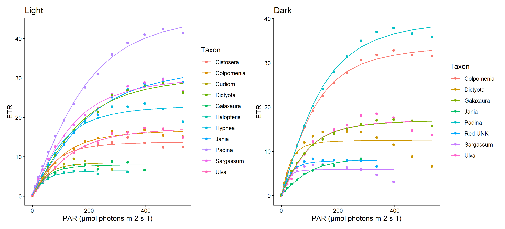
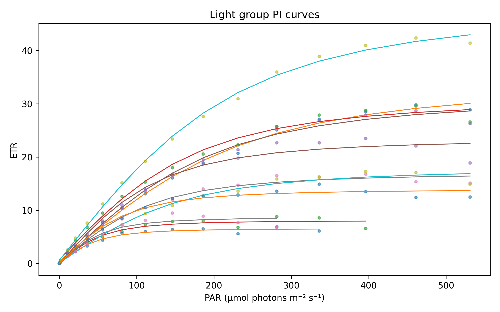
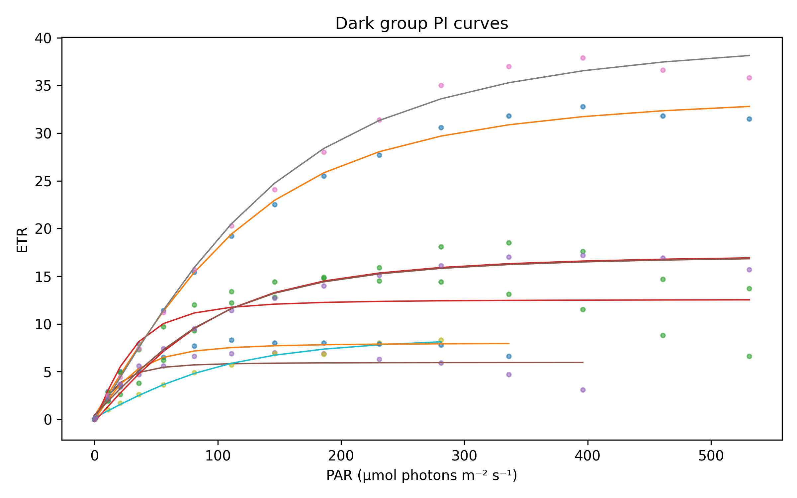
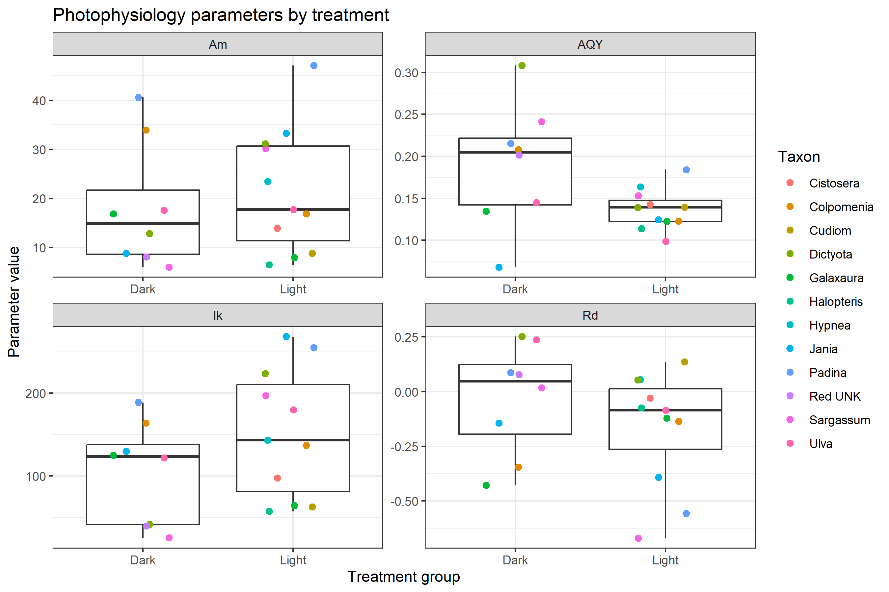
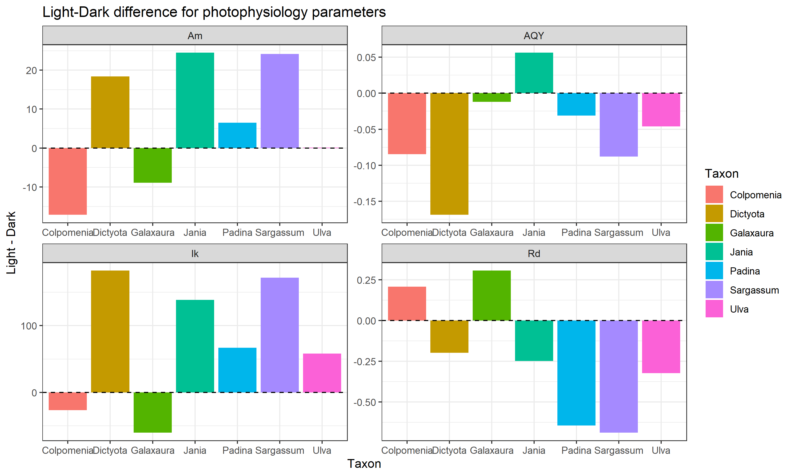
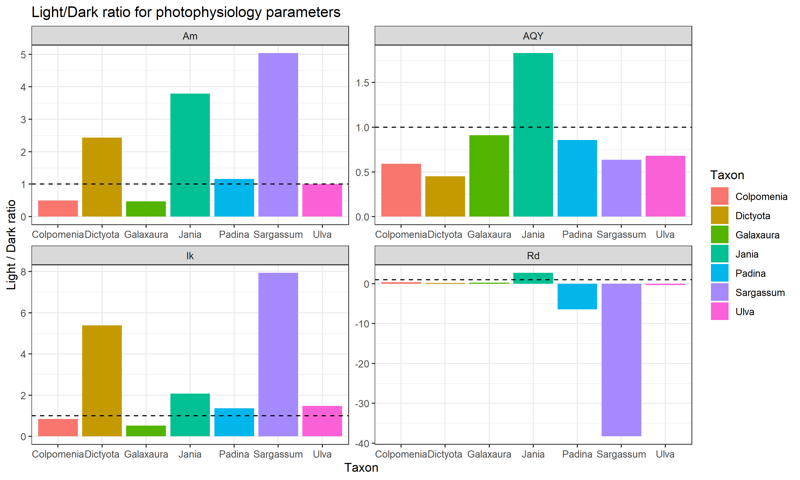

# Photophysiology analysis

## Research aim

The aim of this analysis was to compare photophysiological performance between samples exposed to **Light** and **Dark** treatments using PAM fluorometry data.

## Parameters analyzed

The analysis focused on ETR measurements and parameters estimated from photosynthesis-irradiance (PI) curves.

| Parameter | Meaning | Unit |
|---|---|---|
| ETR | Electron transport rate | Relative ETR units |
| Am / Pmax | Estimated maximum photosynthetic capacity | Relative ETR units |
| AQY / alpha | Initial slope of the PI curve | ETR per PAR |
| Rd | Respiration/intercept term in the fitted curve | Relative ETR units |
| Ik | Saturation irradiance, calculated as Am/AQY | µmol photons m^-2 s^-1 |

## Materials and Methods

Photophysiology data were analyzed in R using PAM fluorometry measurements from light and dark treatment groups. The raw data files were `light.csv` and `dark.csv`, and sample information was imported from `Photophysiology_metadata.csv`.

The raw ETR columns were reshaped from wide to long format. ETR values equal to zero at PAR values above zero were treated as missing values because they indicate that the measurement had ended. Following the exercise script, only PAR values below 600 µmol photons m^-2 s^-1 were used for curve fitting. Samples `Light_3` and `Light_9` were removed because they did not show the expected curve shape in the example script.

PI curves were fitted for each sample using a non-linear least squares model:

```r
ETR ~ (Am * ((AQY * PAR) / sqrt(Am^2 + (AQY * PAR)^2))) - Rd
```

From this model, Am, AQY and Rd were estimated for each sample. Ik was calculated as:

```r
Ik = Am / AQY
```

The analysis was performed in R using the packages `dplyr`, `lubridate`, `hms`, `tidyr`, `ggplot2`, `purrr`, `broom`, and `patchwork`. Package versions are reported in `R_sessionInfo.txt`.

## Results

### Figure 1. PI curves for light and dark treatments

)

**Figure 1.** Photosynthesis-irradiance curves for samples from the light and dark treatment groups. Points represent measured ETR values at each PAR level. Lines represent fitted PI curves for each sample.

### Figure 2. Photophysiology parameters by treatment


**Figure 2.** Estimated photophysiology parameters for light and dark treatments. The parameters are Am, AQY, Rd and Ik. Each point represents one sample, colored by taxon.

### Figure 3. Light/Dark ratios by taxon


**Figure 3.** Light/Dark ratios for each photophysiology parameter by taxon. The dashed line indicates a ratio of 1, meaning no difference between light and dark treatments.

### Figure 4. Light-Dark differences by taxon


**Figure 4.** Difference between light and dark treatments for each taxon and photophysiology parameter. Positive values indicate higher values in the light treatment, while negative values indicate higher values in the dark treatment.

## Tables

**Table 1.** `Photophysiology_parameters.csv` contains the fitted PI-curve parameters for each sample.

**Table 2.** `Photophysiology_summary_table.csv` summarizes each photophysiology parameter by treatment group, including n, mean, standard deviation, median and range.

**Table 3.** `Photophysiology_difference_ratio.csv` presents the Light-Dark difference and Light/Dark ratio for paired taxa.

**Table 4.** `Photophysiology_wilcoxon_tests.csv` presents paired Wilcoxon test results comparing light and dark treatments for each parameter.

## Statistical test results

- AQY: Wilcoxon paired test, n = 7, p = 0.1094, BH-adjusted p = 0.2188 (not significant).
- Am: Wilcoxon paired test, n = 7, p = 0.2969, BH-adjusted p = 0.2969 (not significant).
- Ik: Wilcoxon paired test, n = 7, p = 0.1094, BH-adjusted p = 0.2188 (not significant).
- Rd: Wilcoxon paired test, n = 7, p = 0.2188, BH-adjusted p = 0.2917 (not significant).

## Interpretation

The PI curves describe how ETR changes with increasing light intensity. Am represents the estimated maximum photosynthetic capacity, AQY represents photosynthetic efficiency under low light, Rd represents the respiration/intercept term of the curve, and Ik represents the irradiance level at which photosynthesis shifts from light limitation toward saturation.

The comparison between light and dark treatments allows evaluation of whether prior light conditions affected photosynthetic performance. In this dataset, the paired Wilcoxon tests did not show statistically significant differences after BH correction for the tested parameters. Therefore, based on these data, there is no strong statistical evidence that the light and dark treatments caused consistent changes in Am, AQY, Rd or Ik across paired taxa.

However, the ratio and difference plots show that the response may vary among taxa. This suggests that taxon-specific patterns could be biologically relevant, even if the overall paired statistical tests were not significant with the current sample size.

## Figure 1 – Photosynthesis–Irradiance (PI) curves



**Figure 1.** Photosynthesis–irradiance (PI) curves for all samples from the Light and Dark treatments.

---

## Figure 2 – Light treatment



**Figure 2.** Photosynthesis–irradiance curves for samples in the Light treatment.

---

## Figure 3 – Dark treatment



**Figure 3.** Photosynthesis–irradiance curves for samples in the Dark treatment.

---

## Figure 4 – Photophysiology parameters



**Figure 4.** Distribution of the photophysiological parameters (Am, AQY, Rd and Ik) in the Light and Dark treatments.

---

## Figure 5 – Difference between treatments



**Figure 5.** Difference in photophysiological parameters between the Light and Dark treatments for each taxon.

---

## Figure 6 – Light/Dark ratio



**Figure 6.** Ratio of Light to Dark values for each photophysiological parameter. A value of 1 indicates no difference between treatments.